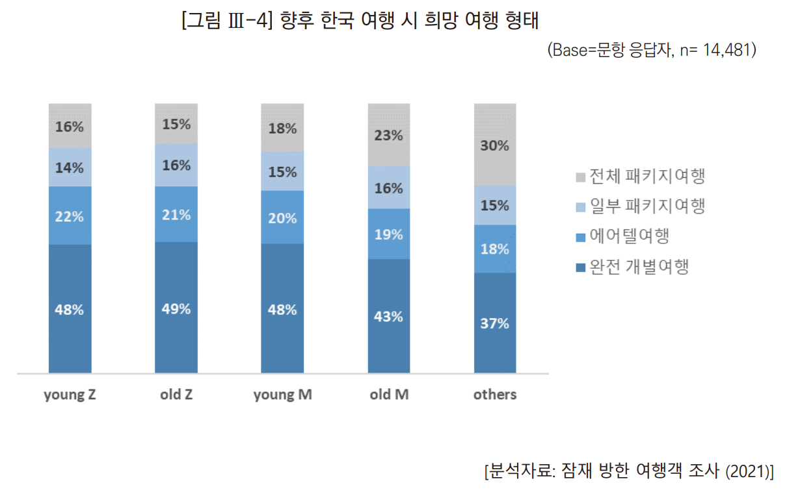
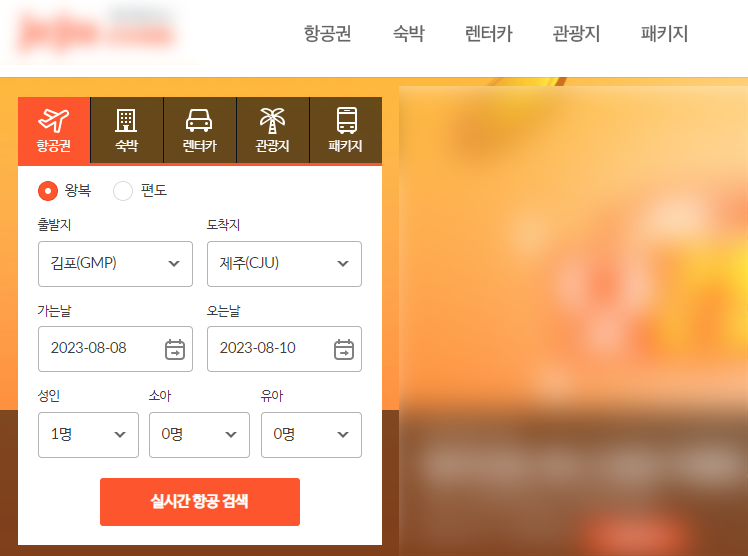

# 여행 종합 정보 추천 서비스
고객이 원하는 옵션에 따라 여행 각종 여행 상품 추천하고 및 여행지 날씨와 맛집 소개하는 종합 여행 정보 추천 서비스

## 목차
- [문제정의](#문제정의)
- [프로젝트 진행 절차 및 업무분담](#프로젝트-진행-절차-및-업무분담)
- [사전기획](#사전기획)
- [데이터 수집과정 및 전처리](#데이터-수집과정-및-전처리)
- [데이터 설명](#데이터-설명)
  - [항공권 (SQLite3 기준)](#항공권-sqlite3-기준)
  - [숙박시설(호텔) (SQLite3 기준)](#숙박시설호텔-sqlite3-기준)
  - [렌터카 (SQLite3 기준)](#렌터카-sqlite3-기준)
  - [날씨 (CSV)](#날씨-csv)
  - [음식점 (실시간 조회)](#음식점-실시간-조회)
- [주요 기능 구현 과정 설명](#주요-기능-구현-과정-설명)
  - [Flask](#flask)
  - [추천 알고리즘](#추천-알고리즘)
  - [미선택 기능](#미선택-기능)
- [프로젝트 결과](#프로젝트-결과)
- [회고](#회고)

## 문제정의
여행을 가기 위해 먼저 드는 생각은 여행패키지이다. 패키지 상품에 구성품들에 할인을 적용되기 때문에 개별 상품을 구매하는 것보다 금전적 이득을 볼 수 있다. 이러한 까닭에 여행을 계획하는 많은 사람들이 여행 패키지를 선호했었고, 대부분의 여행사에서도 패키지를 많이 추천한다. 그런데 특정 연령대 MZ세대는 패키지보다 완전 개별 여행을 선호하는 것을 아래 그래프를 통해 확인할 수 있다.

|  | 
|:--:| 
| 관광 빅데이터 서비스팀, "MZ세대 여행 특성에 관한 연구", (2023), p91 |

세대가 교체되고 트렌드가 바뀜에 따라 이전과는 달리 개별 여행 상품이 부각되는 상태라고 볼 수 있다.

한 편, 각종 여행사 사이트를 확인해보면 여행에 필요한 상품들을 항목별로(항공권, 숙박시설 등) 들어가서 개별 구매할 수 있게 되어 있다.

|  |
| - |
| 특정 여행사 사이트 |

하지만 이는 한 눈에 확인하고 선택할 수 있는 구조가 아니다. MZ세대를 배려한 시스템으로서 개별 상품들을 선택할 수는 있지만, 편리성 면에서는 그렇게 뛰어나다고 할 수 없다.

국내 최대 여행사인 하나투어의 작년 연령별 국외여행 예약 동향 분석 결과를 확인해보면 "10대 이하는 9.1%, 20대 13.5%, 30대 16.5%, 40대 16.6%, 50대 22.5%, 60대 17.4%, 70대 이상 4.4%"이다(출처: [한겨레](https://www.hani.co.kr/arti/economy/marketing/1076933.html)). MZ세대는 전체 연령대에 비해 적지 않은 비율을 차지하는 것을 확인할 수 있다. 이런 MZ세대가 여행 상품에 있어서 패키지 여행보다 개별상품을 선호한다는 것을 비추어 보아, 개별 상품을 한눈에 확인하고 선택할 수 있는 종합 여행 정보 추천 서비스를 기획한다면 이는 여행 시장에서 매우 경쟁력 있는 사이트로 자리잡을 수 있을 것이다. 또한 대부분 여행 패키지에서는 원하지 않는 구성품을 교체할 수 없는데, 이 종합 여행 정보 추천 서비스에서는 패키지처럼 추천 상품들을 한 화면에 보여주되, 원하는 구성품을 선택하거나 제외할 수 있다. 따라서 MZ세대뿐만 아니라 다른 연령대에서도 이를 선호할 것으로 예상되고, 여행 시장에서 새로운 트렌드로 자리매김을 할 수 있을 것이다.

## 프로젝트 진행 절차 및 업무분담
프로젝트는 사전기획으로부터 데이터 수집, 데이터 전처리, 인사이트 도출을 반복하고 서비스를 구축하는 것으로 진행했다. 그리고 프로젝트가 진행되는 동안 각자 맡은 업무는 다음과 같다.

이름 | 업무 | 사용 툴
-- | -- | --
김은혜 | <ul><li>데이터 수집: 날씨, 맛집</li><li>웹 구현: 날씨 표기, 맛집 추천</li></ul> | <ul><li>Selenium</li><li>Flask: HTML</li></ul>
양진모 | <ul><li>데이터 수집: 렌터카, 숙박시설(보조)</li><li>웹 구현<ul><li>항공권, 숙박시설, 렌터카 추천</li><li>모든 웹페이지 연결</li></ul></li></ul> | <ul><li>Selenium</li><li>Flask: HTML, JavaScript, Jinja2</li><li>SQL</li></ul>
정경호 | <ul><li>팀장: 회의 진행</li><li>데이터 수집: 숙박시설</li><li>데이터베이스 구축: 항공권, 숙박시설, 렌터카</li><li>대시보드 작성</li></ul> | <ul><li>Selenium</li><li>SQL</li><li>Looker Studio</li></ul>
정희재 | <ul><li>데이터 수집: 항공권</li><li>웹 구현 보조</li><li>대시보드 작성</li></ul> | <ul><li>Selenium</li><li>HTML, Jinja2</li><li>Tableau</li></ul>

## 사전기획
여행지는 한국에서 유망한 여행지이고 따라서 여행 상품들을 쉽게 찾아볼 수 있는 제주도로 선정했다.

추가적으로 고객에게 상품들을 소개할 때 예측할 것인지 추천할 것인지에 대해 많은 고민이 있었다. 예측은 데이터 학습을 통해 인공지능 모델로 고객이 원할 만한 상품과 가격대를 예측하는 것이고, 추천은 실제 데이터를 나열하는 것이다. 성능이 매우 좋은 모델로 고객에게 맞춤형 결과들을 소개한다면 이것 자체로도 좋은 서비스이다. 하지만 예측된 결과들은 말 그대로 예측이지, 실제 상품은 아니다. 개별 여행 상품을 선호한다는 것은 여러 나열된 항목들로부터 옵션과 가격을 하나하나 따져 가면서 선택하는 것인데, 고객이 예측 결과를 비교하면서 최종 결과를 선택했다고 실제 해당하는 상품이 없거나 옵션이 다르다면 이는 스스로 원하는, 정확한 상품을 선택했다고 볼 수 없다. 반면에 추천은 기존 여행사에서 상품들을 추천하는 것과 마찬가지로 고객이 원하는 옵션에 해당하는 실제 상품들을 나열한다. 이 추천 상품들 중 원하는 것을 선택하는 것이 완전 개별 여행을 위한 서비스를 제공하는 것에 훨씬 적합하다. 따라서 인공지능 모델을 통한 상품 예측이 아닌 실제 상품 추천을 우리 서비스의 기본 기능으로 선택했다.

어떤 여행 상품을 추천할지에 대한 논의도 있었는데, 여행에 필수라고 할 수 있는 항공권, 숙박, 그리고 렌터카를 기본 항목으로 설정하기로 했다. 그리고 다른 여행 서비스와 추가적인 차별점을 두기 위해 상품 자체는 아니지만 여행에 매우 중요한 항목으로 여행지/숙박시설 기준 날씨와 맛집 추천 기능도 계획했다.

## 데이터 수집과정 및 전처리
셀레니움을 이용하여 데이터를 수집했는데, 일부 항목, 즉 숙박시설과 렌터카의 경우 수집할 데이터의 양이 다른 데이터에 비해 훨씬 많았다. 렌터카를 기준으로 설명하자면, 웹사이트 시범 운영을 위해 한 달(30일)의 데이터를 수집해야 했는데, 한 달 사이 날짜 조합으로만 435개가 있고, 시간 조합으로는 대여시간과 반납시간이 각각 대략 06시부터 22시까지 30개 중 선택이 가능하여 $435 \times 30 \times 30 = 391500$의 경우의 수가 나왔다. 하나의 페이지에서 데이터를 수집하는데 걸리는 시간이 대략 10-20초라고 가정하면 전체 데이터수집은 대략 6000000초, 즉 70일이 걸린다. 시간 단축을 위해 병렬실행을 연구했는데, 파이썬의 `concurrent.futures` 모듈의 `ThreadPoolExecutor` 클래스를 이용해 코드를 구현했다. 보유한 컴퓨터 사양으로 8개의 쓰레드/Thread(작업할 수 있는 단위)는 여전히 10일 정도의 시간이 걸릴 것으로 예상되었다. 따라서 렌터카의 경우 대여하고 반납하는 시간을 12시로 고정해 데이터를 수집했다. 완성된 병렬 실행 코드를 숙박시설 데이터 수집에도 적용해서 한 번 데이터를 수집할 때 $435 \times 4(\rm{인원수}) \times 4(\rm{페이지수}) \times 30(\rm{시간, 초}) / 12(\rm{쓰레드: 가상 포함}) = 5(\rm{시간})$ 안에 숙박시설 데이터 수집을 마쳤다. 덧붙여서 데이터를 수집한 숙박시설 사이트는 한 번 접속에 한 번의 팝업이 떴는데, 그 시점이 무작위라서 데이터 수집에 간헐적으로 오류가 났었는데, 오류가 난 날짜 조합과 인원수, 페이지 번호를 기록해서 해당 순번에 대해 다시 시도하여 데이터를 전부 수집하였다.

데이터 전처리로는 통일성 있는 데이터베이스 구축을 위해 날짜와 시간을 하나의 DATETIME/TIMESTAMP 칼럼으로 구성해 시작시간과 대여시간(항공기 출발시간, 렌터카 대여시간)을 구성했다. 또한 전처리 전 수집한 데이터는 나이제한이나 항공 등에 `22세 이상`, `(GMP-CJU)` 등의 텍스트가 붙어 있는데, 연산에 용이하고 최종적으로 웹페이지에 보여줄 형식으로 바꿀 때 직관적으로 바꾸기 위해 텍스트를 분할하거나(`GMP`, `CJU`로 분할) 숫자만 있도록 뒤따르는 텍스트를 지우는(`22세 이상` &rarr; `22`) 등의 전처리를 진행했다.

또한 개성 있는 서비스를 제공하고, 고객이 자신의 금전적 상황을 생각할 수 있도록 위해 항공권, 숙박시설, 그리고 렌터카에 `금전_상황` 이라는 칼럼을 생성했다. 상품들을 시작/종료 날짜 조합으로 모아서 금액을 5 구간으로 나누어 금액이 낮은 구간 순으로 `자린고비`, `가성비`, `평범`, `욜로`, 그리고 `플렉스`의 레이블을 부여해서 고객의 시선을 이끌 수 있고, 예산을 어느 정도 예상하여 옵션을 고를 수 있도록 선택지를 추가했다.

## 데이터 설명
최종적으로 보유한 데이터는 아래와 같다. 모든 데이터는 셀레니움으로 수집했으며, 별도로 데이터형을 명시하지 않는 경우는 STR/CHAR이다.

### 항공권 (SQLite3 기준)
데이터 수집 경로: 네이버 항공 - https://flight.naver.com/
칼럼명 | 설명
-- | --
`name` | 항공사 브랜드명
`seat` | 항공권 특징(일반, 할인, 특가)
`adult_charge` | 성인 1인 기준 항공권 가격(원, INT)
`child_charge` | 소아 1인 기준 항공권 가격(원, INT)
`leavehour` | 항공편 출발 시각(only hour, INT)
`check` | 제주 기준 출발(come) or 도착(back) 확인 컬럼
`departure` | 출발 공항(코드)
`arrival` | 도착 공항(코드)
`departure_kor` | 출발 공항(한국어)
`arrival_kor` | 도착 공항(한국어)
`departure_datetime` | 출발 날짜 및 시간(TIMESTAMP)
`arrival_datetime` | 도착 날짜 및 시간(TIMESTAMP)
`금전_상황` | 해당 날짜 기준으로 금액 등급 5개로 구분(자린고비, 가성비, 평범, 욜로, 플렉스)

고객 선택 옵션으로 `금전_상황`, `departure_kor`,`name` 칼럼을 이용했고, 추가적으로 `성인`(인원수), `아동`(인원수), `편도/왕복` 옵션을 구성해서 옵션의 폭을 넓혔다.

### 숙박시설(호텔) (SQLite3 기준)
데이터 수집 경로: Booking.com - https://www.booking.com/
칼럼명 | 설명
-- | --
`hotel_name` | 숙박시설 이름
`region` | raw 지역명(시읍면동)
`ratings` | 별점(0-5, FLOAT)
`price` | 숙박비용(원, INT)
`start_date` | 숙박 시작일(TIMESTAMP)
`end_date` | 숙박 종료일(TIMESTAMP)
`capacity` | 인원수(1-4, INT)
`new_region` | 전처리 후 지역명(시읍면동)
`금전_상황` | 해당 날짜 기준으로 금액 등급 5개로 구분(자린고비, 가성비, 평범, 욜로, 플렉스)

고객 선택 옵션은 `금전_상황`, `region`, `capacity` 칼럼으로 구성했다.

### 렌터카 (SQLite3 기준)
데이터 수집 경로: jeju.com - https://www.jeju.com/item/ren_meta.html?agt=jeju
칼럼명 | 설명
-- | --
`car_name` | 자동차 모델명
`brand_name` | 자동차 제조사명
`seats` | 좌석개수(INT)
`size` | 소형/중형 등
`fuel_type` | 연료타입
`transmission_type` | 자동/수동
`rental_company_name` | 렌트카 회사명
`age_req` | 최소 나이(INT)
`driving_experice` | 운전 경력(INT)
`year` | 자동차 연식
`ratings` | 별점(0-5, FLOAT)
`num_ratings` | 리뷰 개수(INT)
`price` | 렌트비용(원, INT)
`start_date` | 렌트 시작일(TIMESTAMP)
`end_date` | 렌트 종료일(TIMESTAMP)
`금전_상황` | 해당 날짜 기준으로 금액 등급 5개로 구분(자린고비, 가성비, 평범, 욜로, 플렉스)

고객 선택 옵션은 `금전_상황`, `age_req`, `size`, `seats`,`brand_name`, `fuel_type`, `transmission_type`, `driving_experience` 칼럼으로 구성했다.

### 날씨 (CSV)
데이터 수집 경로: AccuWeather - https://www.accuweather.com/ko/kr/jeju/224209/august-weather/224209?year=2023
칼럼명 | 설명
-- | --
`Day` | 날짜(Ymd의 d, INT)
`Weather` | 날씨
`Low Temperature` | 최저 기온(&deg;C, INT)
`High Temperature` | 최고 기온(&deg;C, INT)

### 음식점 (실시간 조회)
데이터 수집 경로: 망고플레이트 - https://www.mangoplate.com/
칼럼명 | 설명
-- | --
`Title` | 식당명
`Total Score` | 별점(0-5, FLOAT)
`Address` | 주소
`Menu` | 대표 메뉴

## 주요 기능 구현 과정 설명
### Flask
종합 여행 정보 추천 서비스를 배포하기 위해서 웹 배포 프레임워크인 Flask를 이용했다. 특별히 효율적으로 옵션을 관리하고 트렌드에 따라 고객이 관심 있을 만한 옵션을 변경하기 위해 Jinja2 템플릿(HTML에 반복문, 조건문, 그리고 변수를 이용하는 틀)을 적극적으로 활용했다. 항공권, 숙박시설, 그리고 렌터카에 해당하는 옵션과 그 옵션에 해당하는 데이터값이 제각각인데, 이를 모두 HTML에 명시하는 것이 아니라 반복문과 변수명을 이용해 짧은 코드로 모두 표현하였다.

### 추천 알고리즘
고객이 선택한 옵션을 기준으로 상품들을 추천하기 위해 데이터에 필터와 정렬을 적용했다. 옵션들은 모든 날짜와 상품들에 대해 합집합(Union)을 적용했기 때문에 선택한 모든 옵션에 대해 필터를 적용하면 해당사항이 없어 비어있는 데이터를 반환받는 경우가 생기기 때문에 SQLite3의 Common Table Expression(CTE) 표현법으로 필터를 순차적으로 적용하는 임시 테이블을 생성했다. 임시 테이블에 데이터가 없으면 해당 필터는 무시하고 직전 임시 테이블에서 다음 필터를 적용하는 방식이다. 이를 통해 고객이 선택한 옵션에 해당하는 상품이 없는 경우 해당 옵션은 제외하고 상품을 나열하도록 했는데, 조회된 데이터가 없어서 해당 옵션을 제거하고 다시 조회하는 불편함을 줄이고, 정렬은 별점이 있는 숙박시설과 렌터카는 별점 순으로, 그리고 별점이 없는 항공권은 금액 순으로 적용했다.

### 미선택 기능
완전 개별 여행이라는 취지에 맞추어 시범적으로 항공권과 렌터카에 미선택의 기능을 구현해보았다. 항공권의 경우 여행을 갔다가 오는 것으로 끝마치는 것이 아니라 장기 여행을 떠날 것을 고려해 왕복/편도 옵션에서 편도를 선택할 경우 가는 편만 추천한다. 그리고 렌터카를 이용하는 것만이 교통수단이 아니고, 여행 계획이나 종류에 따라 원하거나 필요한 교통수단(자전거 여행, 택시 여행 등)이 별도로 있을 것을 고려해 렌터카에 미선택 기능도 추가했다.

## 프로젝트 결과
언급했던 내용을 토대로 기능을 구현하고 웹사이트를 구축했을 때 기획 단계에서 구상했던 내용이 빠짐 없이 작동하는 것을 확인했다. 즉, 여행 기간과 옵션을 선택하면 이를 기준으로 데이터를 정렬하여 현재로서 Top3 상품들을 추천하고, 고객이 이 중에서 최종적으로 선정할 수 있는 웹사이트를 구현했다. 최종 선택을 확인함과 동시에 여행기간의 날씨와 주변 맛집도 추천한다.

## 회고
좋은 팀원들과 함께 포기 없이 9일이라는 짧은 기간 안에 프로젝트를 완성한 것이 매우 뜻 깊었다. 김은혜님 [@eunhyekim0070](https://github.com/eunhyekim0070), 정경호님 [@dnq0904](https://github.com/dnq0904), 그리고 정희재님 [@HeeJaeddie](https://github.com/HeeJaeddie)께 감사드린다. 또한 프로젝트에 필요한 기능을 구현하기 위한 알고리즘과 툴을 복습하고 추가적으로 배운 의미 있는 시간이었다.

다만 짧은 기간 안에 완성했어야 하는 관계로 코드나 기능의 효율성이 떨어지는 부분 몇 가지가 있다.
- 자바스크립트가 전부 HTML 안에 있고, HTML 구성 또한 난잡하다. Flask의 권장사항과 깔끔한 프로젝트 구조로서 둘을 분리해놓을 필요가 있다.
- SQL에 현재 CTE를 적용해서 필터를 구성하는데, 필터를 하나씩 적용하기 위해 필터 하나당 두 개의 임시 테이블을 만들고 있다. Recursive CTE의 자기참조를 통해 SQL 쿼리문을 간소화하고 성능을 높일 수 있을 것으로 예상된다.
- 맛집 추천 알고리즘은 숙박시설의 주소 정보가 입력되면 셀레니움을 통해 실시간으로 조회하는데, 속도적인 측면에서 단점이 매우 크다. 망고플레이트나 기타 맛집 정보 사이트에서 제공하는 API가 있는지 확인이 필요하다.
- 날씨는 수시로 변하는데 스크레이핑을 통해 데이터를 수집해 데이터베이스에 보유하고 있다. 날씨를 실시간으로 조회해서 표기하는 것으로 내부 기능을 바꿔볼 필요가 있다.
- 항공권, 숙박시설, 렌터카 데이터는 추천 기능 구현을 위해 최초 수집 후 업데이트 하지 않은 상태이다. 최신 상품 정보로 업데이트 하기 위해서 주기적으로 데이터를 수집하거나, 여행상품 판매업체와 연결하여 관리하는 것을 생각해볼 수 있다.
- 현 웹사이트는 프로토타입이다. 추천을 위주로 기능을 구현했고, 실제 상품 구매와는 연결이 되지 않는다. 상품에 대해 사진을 보여주고 구매할 수 있는 웹페이지를 기존 구매 링크로 제공하거나 직접 설계하는 등의 기능과 디자인적인 부분을 업그레이드 할 필요가 있다.
